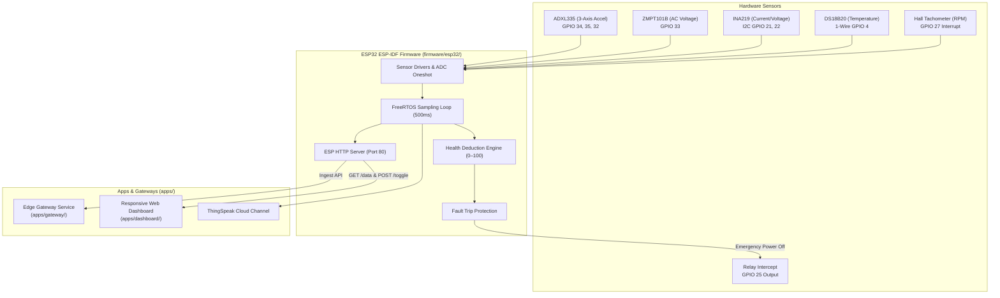

# 🛡️ INFRA-NEX — Motor Guard Monorepo

> **Smart Industrial Motor Protection & Real-time Health Telemetry System**  
> Complete monorepo containing native ESP-IDF C firmware, edge gateway API, responsive web dashboard UI, hardware schematics, RTL health scoring modules, and technical documentation.

---

## 🗂️ Monorepo Directory Architecture

```
Motor_Guard/
├── apps/
│   ├── dashboard/                # Web dashboard frontend (infraweb.html, esp.html)
│   └── gateway/                  # Node.js edge gateway service (server.js)
├── firmware/
│   ├── esp32/                    # Native ESP-IDF C project (CMakeLists.txt, main.c, drivers)
│   └── libraries/                # Shared C/C++ firmware headers (MotorGuardCore)
├── hardware/
│   ├── schematics/               # Circuit pinout & wiring diagrams (pinout.md)
│   ├── bom/                      # Bill of Materials & electrical limits (BOM.md)
│   └── pcb/                      # PCB specs & physical enclosure layout
├── packages/
│   └── core/                     # Shared telemetry JSON schema & data contracts
├── docs/
│   ├── architecture.md           # Subsystem architecture & FreeRTOS task specs
│   ├── setup.md                  # ESP-IDF setup, flashing, & troubleshooting guide
│   └── protocol.md               # Telemetry API endpoints & ThingSpeak payload spec
├── scripts/                      # Build & flash scripts (.bat & .sh)
├── .github/
│   └── workflows/                # GitHub Actions CI firmware build workflow
├── .env.example                  # Environment variables template
├── .gitignore                    # Git exclusion rules
└── README.md                     # Monorepo documentation entrypoint
```

---

## 📐 System Overview & Architecture



---

## ⚡ Quickstart — ESP-IDF Firmware Setup

### 1. Build & Flash Firmware
Open your **ESP-IDF Terminal** and run:

```bash
# Using provided scripts (Windows)
.\scripts\build_firmware.bat
.\scripts\flash_firmware.bat COM3

# Or using idf.py directly
cd firmware/esp32
idf.py set-target esp32
idf.py build
idf.py -p COM3 flash monitor
```

### 2. Launch Local Gateway (Optional)
```bash
cd apps/gateway
npm install
npm start
```

---

## 🔌 Hardware Pin Mapping

| ESP32 Pin | Peripheral / Sensor | Signal / Interface |
| :--- | :--- | :--- |
| **GPIO 34** | ADXL335 | X-Axis Analog Input (ADC1_CH6) |
| **GPIO 35** | ADXL335 | Y-Axis Analog Input (ADC1_CH7) |
| **GPIO 32** | ADXL335 | Z-Axis Analog Input (ADC1_CH4) |
| **GPIO 33** | ZMPT101B | AC Voltage Input (ADC1_CH5) |
| **GPIO 27** | Hall Effect Sensor | Tachometer Pulse Interrupt |
| **GPIO 4** | DS18B20 | 1-Wire Thermal Data (4.7k&Omega; pull-up) |
| **GPIO 21** | INA219 | I2C SDA |
| **GPIO 22** | INA219 | I2C SCL |
| **GPIO 25** | Relay Module | Emergency Power Trip Output |

*See [`hardware/schematics/pinout.md`](file:///c:/Users/praza/Desktop/Motor_Guard/hardware/schematics/pinout.md) and [`hardware/bom/BOM.md`](file:///c:/Users/praza/Desktop/Motor_Guard/hardware/bom/BOM.md) for full schematics.*

---

## 📊 Health Score Formula

The motor health score is computed dynamically in real time:

$$\text{Health Score} = \max\left(0, 100 - \sum \text{Deductions}\right)$$

- **RPM Stall / Over-speed**: -20 pts
- **RPM Degraded**: -10 pts
- **AC Voltage Bad**: -20 pts
- **High Current**: -20 pts
- **High Temperature**: -20 pts
- **Excessive Vibration**: -20 pts

---

## 📄 License
Licensed under the MIT License.
