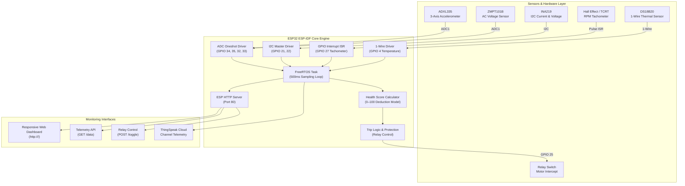

# 🛡️ INFRA-NEX — Smart Industrial Motor Guard & Health Monitoring System

> **Native ESP-IDF Firmware & Industrial IoT Protection Dashboard**  
> Multi-sensor telemetry acquisition (ADXL335, ZMPT101B, INA219, DS18B20, Hall Effect), real-time health score computation algorithm, automatic emergency relay tripping, and high-performance Web Server API.

---

## 📐 System Architecture



---

## 🗂️ Repository Map

| Directory / File | Description |
| :--- | :--- |
| [`firmware/`](file:///c:/Users/praza/Desktop/Motor_Guard/firmware) | Native C ESP-IDF firmware (`CMakeLists.txt`, `main/main.c`, `main/sensors.c`, `main/health_score.c`, `main/web_server.c`) |
| [`web/`](file:///c:/Users/praza/Desktop/Motor_Guard/web) | Standalone responsive dark-themed dashboard frontend UI (`index.html`, `esp.html`) |
| [`hardware/`](file:///c:/Users/praza/Desktop/Motor_Guard/hardware) | Hardware specifications, Bill of Materials ([`BOM.md`](file:///c:/Users/praza/Desktop/Motor_Guard/hardware/BOM.md)), and GPIO connection table ([`pinout.md`](file:///c:/Users/praza/Desktop/Motor_Guard/hardware/pinout.md)) |
| [`rtl/`](file:///c:/Users/praza/Desktop/Motor_Guard/rtl) | Verilog hardware deduction logic ([`health_score_calc.v`](file:///c:/Users/praza/Desktop/Motor_Guard/rtl/health_score_calc.v)) |
| [`docs/`](file:///c:/Users/praza/Desktop/Motor_Guard/docs) | Project specifications ([`PRD.md`](file:///c:/Users/praza/Desktop/Motor_Guard/docs/PRD.md)), architecture guide ([`ARCHITECTURE.md`](file:///c:/Users/praza/Desktop/Motor_Guard/docs/ARCHITECTURE.md)), and ESP-IDF runbook ([`RUNBOOK.md`](file:///c:/Users/praza/Desktop/Motor_Guard/docs/RUNBOOK.md)) |

---

## ⚡ Quickstart — ESP-IDF Terminal Guide

### Prerequisites
- Install **ESP-IDF v5.x** (or set up ESP-IDF command environment).
- Connect ESP32 board via USB.

### Build & Flash Commands
Open your **ESP-IDF Terminal** and run:

```bash
cd firmware

# Set target to ESP32
idf.py set-target esp32

# Configure project (optional)
idf.py menuconfig

# Build project
idf.py build

# Flash firmware and launch serial monitor (replace COMX with your port, e.g., COM3 or /dev/ttyUSB0)
idf.py -p COM3 flash monitor
```

---

## 🔌 Hardware Wiring & Pin Mapping

| ESP32 Pin | Sensor Module | Function |
| :--- | :--- | :--- |
| **GPIO 34** | ADXL335 | X-Axis Analog Input |
| **GPIO 35** | ADXL335 | Y-Axis Analog Input |
| **GPIO 32** | ADXL335 | Z-Axis Analog Input |
| **GPIO 33** | ZMPT101B | AC Voltage Input |
| **GPIO 27** | Hall Effect | Tachometer Pulse Interrupt |
| **GPIO 4** | DS18B20 | 1-Wire Temperature Data |
| **GPIO 21** | INA219 | I2C SDA |
| **GPIO 22** | INA219 | I2C SCL |
| **GPIO 25** | Relay Module | Emergency Power Trip Output |

*For complete electrical details, see [`hardware/pinout.md`](file:///c:/Users/praza/Desktop/Motor_Guard/hardware/pinout.md) and [`hardware/BOM.md`](file:///c:/Users/praza/Desktop/Motor_Guard/hardware/BOM.md).*

---

## 🌐 Web Server API Endpoints

Once connected to Wi-Fi, the ESP-IDF web server exposes:

- **`GET /`**: Serves the interactive telemetry dashboard interface.
- **`GET /data`**: Returns real-time JSON metrics:
  ```json
  {
    "rpm": 450.0,
    "voltage_V": 230.5,
    "current_A": 0.215,
    "temp_body_C": 28.5,
    "temp_bearing_C": 31.0,
    "vib_g": 0.045,
    "healthScore": 100,
    "fault": "SYSTEM NORMAL",
    "faultLevel": 0,
    "relayState": false,
    "uptime": 124
  }
  ```
- **`POST /toggle`**: Manually toggles the emergency relay state.

---

## 📊 Health Score Formula

The motor health score is calculated in real time (0–100 range):

$$\text{Health Score} = \max\left(0, 100 - \sum \text{Deductions}\right)$$

| Condition | Deduction |
| :--- | :--- |
| **RPM Stall / Over-speed** | -20 pts |
| **RPM Degraded** | -10 pts |
| **AC Voltage Bad** | -20 pts |
| **High Current** | -20 pts |
| **High Temperature** | -20 pts |
| **Excessive Vibration** | -20 pts |

---

## 📄 License
Licensed under the MIT License.
